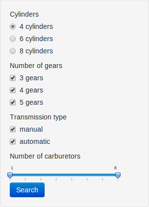

## Introduction

1. Motor Trends on Cars in an application that examine a dataset called **mtcars** to extract some basic statistics.
2. The dataset contains some automobiles from the from the 1974 _Motor Trend_ US magazine.

In this dataset there are:

```{r}
nrow(mtcars)
```

automobiles, described in

```{r}
ncol(mtcars)
```

features, ranging from **miles per gallon** to **weight** of the vehicle.

--- .class #id 

## The Application

The application is in http://andrecarvalho.shinyapps.io/ddp-finalproject/. Click in the _Application_ tab to view the application.

<div style="width: 40%; display: inline-block">
    <picture>
        
        <legend style="margin: 10px 15px">Filter of automobiles</legend>
    </picure>
</div>

<div style="width: 59%; display: inline-block; float: right">
    <p>The filters are:</p>
    <ul>
        <li>Cylinders: a radio button list to select one possible value for the number of cylinders</li>
        <li>Number of gears: a checkbox list to select multiple value for the number of gears</li>
        <li>Transmission type: a checkbox list for transmission types manual and automatic</li>
        <li>Number of carburetors: a slider for the range for the amount of carburetors in the engine</li>
    </ul>
</div>

---

## Results example

Suppose I want to filter all the automobiles with 8-cylinder engines, manual transmission and 4 carburetors and more. Part of the results are shown below (the function for filter will be ommited for brevity).

```{r, echo = FALSE}
library(pander)

filterData <- function(cyls, gears, transmType, carb) {
    data <- cbind(car = rownames(mtcars), mtcars)
    res <- data[
        data$cyl == cyls &
        data$gear %in% as.integer(gears) &
        data$am %in% as.integer(transmType) &
        data$carb >= as.integer(carb[1]) &
        data$carb <= as.integer(carb[2]), ]
    if (nrow(res) > 0) {
        res
    } else {
        data
    }
}

res <- filterData(cyls = '8', gears = c('3', '4', '5'), transmType= c('0'), carb = c(4, 8))[, 2:6]
pandoc.table(res, style = 'simple')
```

The data is diplayed in a nice data grid component which allows sorting by each column.

---

## Motor Trends basic statistics

There are very basic statistics calculated by the application:

* Mean MPG
```{r}
mean(res$mpg)
```

* Mean HP
```{r}
mean(res$hp)
```

* Mean time for 1/4 mile
* Mean weight

---

## Questions

1) What is the mean weight for the cars in the previous filtered dataset?

1. 5.5400
2. 6.3232
3. 4.6858
4. 3.9999

<br>

2) What happens if you try to filter out all data? You can do it by unchecking all 'transmission type' checkboxes.
